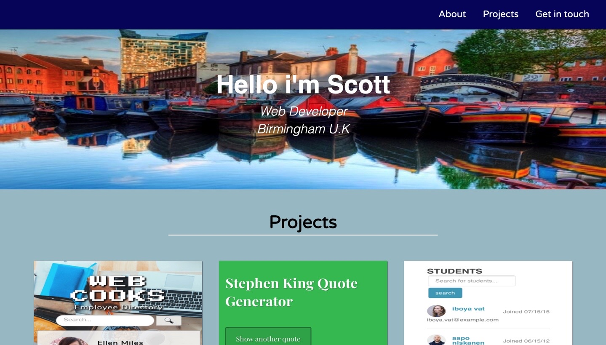

# Responsive Web Design - Project 5

---

## HTML and CSS Portfolio

## Live Demo

https://webdevbrum.github.io/portfolio1/

---

## Getting Started

No pre requisite installation required. Built using HTML and CSS